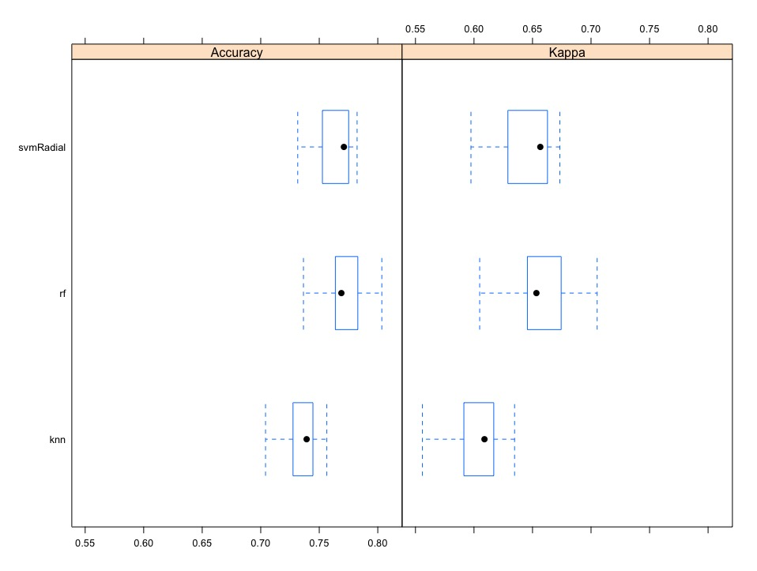

# Conclusions
* The data for **Samsung** contains **very few mentions of the brand** Samsung or Galaxy, making the data of little use for sentiment analysis.
* This leads us to believe **something went wrong in the data collection phase**.
* The overall **sentiment for iPhone models is very positive**  (The overall ratio positive to negative is over 10 to 1)
* If time doesn't permit for further investigation of the opinion on the brand Samsung, we **recommend to move ahead with iPhone**. The overwhelming positive sentiment is the main motivation for this recommendation.


# Recommendations and Next Steps
* If further research isn't possible, select the iPhone to run the applications.
* Gather new data for Galaxy and check mapper function for the brand Galaxy
* Try additional machine learning methods
* Test dictionnary based sentiment analysis methods instead of machine learning methods
* Test different hyperparameters values unique for each machine learning model.

# Analysis

## Introduction
* Helio is working with a **government health agency** to create a suite of smart phone **medical apps** for use by aid workers in developing countries.
* **One phone** needs to be selected to **run the application**
* A short list of devices that are all capable of executing the app suite's functions werer provided
* Conduct a broad-based web **sentiment analysis** to gain insight into the attitudes toward the devices

## Load data

We have two data sets available. One with

```{r warning=FALSE}
pacman::p_load(pacman, rstudioapi, caret, doParallel, corrplot, tidyverse)
```


```{r warning=FALSE}
# Import data
data_iphone <- read.csv(file = "/Users/davidverbiest/google_drive/data_science/ubiqum/m4/t3/data/iphone_smallmatrix_labeled_8d.csv")
data_galaxy <- read.csv(file = "/Users/davidverbiest/google_drive/data_science/ubiqum/m4/t3/data/galaxy_smallmatrix_labeled_8d.csv")
```


## Initial exploration

```{r warning=FALSE, echo=FALSE, results='asis'}
knitr::kable(head(data_iphone, 5))
#knitr::kable(str(data_iphone))
knitr::kable(head(data_galaxy, 5))
#knitr::kable(str(data_galaxy))
```

* We have many features available for analysis
* We notice that the both data sets have similar headers.

Let's take a look at the number of times each brand was mentioned for the respective websites

```{r warning=FALSE, echo=FALSE}
ggplot(data = data_galaxy, aes(x = data_galaxy$samsunggalaxy)) +
  geom_histogram(stat = "count", fill = "#33A1DE") +
  xlab("Times Galaxy/Samsung was mentioned on a webpage")
```

We see that for most intances there are almost no mentions of Samsung or galaxy phones on the website. Pages that only have one or two mentions of the brand could just be noise i.e. the person mentions they saw a great Samsung/iphone commercial. This leads us to believe that these webpages do not really convey much information about the true sentiment of this brand/phone (Or that the mapper function doesn't). Therefore we will not continue with this data set. It is recommended to gather the data again and include more webpages that contain more Samsung mentions or take a closer look at the mapper function and look for any potential errors.

```{r warning=FALSE, echo=FALSE}
ggplot(data = data_iphone, aes(x = data_iphone$iphonesentiment)) +
  geom_histogram(stat = "count", fill = "#33A1DE") +
  xlab("Times iPhone was mentioned on a webpage")
```

For the same reason we drop the rows that have less than 3 iphone mentions

```{r warning=FALSE, include=FALSE}
data_iphone <- data_iphone[data_iphone$iphone > 2,]
```

When we check for NA's or NULL we see that there are none in the data set

```{r warning=FALSE}
sum(is.na(data_iphone))
sum(is.null(data_iphone))
```

## Preprocessing adn feature selection

We recode the sentiment classes to negative (0, 1), neutral (2, 3), and positve (4, 5)
```{r warning=FALSE}
# Recode sentiment
data_iphone[data_iphone$iphonesentiment %in% c(4, 5), ]$iphonesentiment <- "positive"
data_iphone[data_iphone$iphonesentiment %in% c(0, 1), ]$iphonesentiment <- "negative"
data_iphone[data_iphone$iphonesentiment %in% c(2, 3), ]$iphonesentiment <- "neutral"

# Convert to factor
data_iphone$iphonesentiment <- as.factor(data_iphone$iphonesentiment)
```

Let's take a closer look at the distribution of the classes
```{r warning=FALSE, echo=FALSE}
ggplot(data = data_iphone, aes(x = iphonesentiment)) +
  geom_histogram(stat = "count", fill = "#33A1DE") +
  xlab("iPhone sentiment")


# Let's check class imbalances
#knitr::kable(table(data_iphone$iphonesentiment))
```

We observe a clear class imbalance. To deal with class imbalance we use a method called upSample from the CARET package. This method will create artificial data from the minorty classes until the classes are balanced. We can see the result of upSample below.

```{r warning=FALSE, echo=TRUE}
# Upsample and downsample
data_iphone <- upSample(x = data_iphone[, -ncol(data_iphone)], y = data_iphone$iphonesentiment)
```

```{r warning=FALSE}
# the upSample function automaticaly converts the colnames of the label to "Class", rename "Class" to "iphonesentiment"
colnames(data_iphone)[59] <- "iphonesentiment"
```

```{r warning=FALSE, echo=FALSE}
# Show results
knitr::kable(table(data_iphone$iphonesentiment))
```

In the next step we will select a subset of features that will be included in our model. We looked at the following methods:

* Eliminate near zero variance features
* Use recursive feature elimantion (RFE)

We found the best results for RFE, which can be found with the following code

```{r warning=FALSE, eval=FALSE}
# Let's sample the data before using RFE
iphoneSample <- data_iphone[sample(1:nrow(data_iphone), 1000, replace=FALSE),]

# Set up rfeControl with randomforest, repeated cross validation and no updates
ctrl <- rfeControl(functions = rfFuncs,
                   method = "repeatedcv",
                   repeats = 5,
                   verbose = FALSE)

# Use rfe and omit the response variable (attribute 59 iphonesentiment)
rfeResults <- rfe(iphoneSample[,1:58],
                  iphoneSample$iphonesentiment,
                  sizes=(1:58),
                  rfeControl=ctrl)

```

```{r warning=FALSE, include=FALSE}
df <- read.csv(file = "/Users/davidverbiest/google_drive/data_science/ubiqum/m4/t3/data/rfeResults.csv")
load(file = "/Users/davidverbiest/google_drive/data_science/ubiqum/m4/t3/saved_objects/rfeResults.RData")
```

We see that the optimal set of features is 37 (greatest accuracy and kappa and similar standard deviations to runner ups)

```{r echo=FALSE, warning=FALSE}
df_rfeResults <- rfeResults$results
knitr::kable(head(df_rfeResults[ order(df_rfeResults$Accuracy, decreasing = T),]))
```


```{r warning=FALSE }
# Plot results
plot(rfeResults, type=c("g", "o"))
```

Create new data set with rfe recommended features
```{r warning=FALSE}
iphoneRFE <- data_iphone[,predictors(rfeResults)]

# add the dependent variable to iphoneRFE
iphoneRFE$iphonesentiment <- data_iphone$iphonesentiment
```

The data frame we will be modeling with:

```{r warning=FALSE, eval=FALSE}
knitr::kable(str(iphoneRFE))
```

Rename iphoneRGE as df for modeling purposes
```{r warning=FALSE}
df <- iphoneRFE
```


## Modeling


```{r eval=FALSE}
# Create models and predict on test
models = c("rf", "knn", "svmRadial")
models_fitted <-  list()
models_results <- list()
aggr_confusion_matrix <- list()

# Set-up resampling method
fit_control <-  trainControl(method = "repeatedcv",
                             number = 5,
                             repeats = 3)

for (i in models) {
  
  model <- train(iphonesentiment ~ ., 
                 data = df, 
                 preProc = c("center", "scale"),
                 method = i,
                 trControl = fit_control,
                 metric = "Accuracy")
  
  models_fitted[i] <- list(model)
  
  models_results[i] <- list(model$results)
}
```

If we look at the results of the different models we see that the random forest performs the best in terms of accuracy and kappa. The support vector machine might have a slightly higher accuracy. However, the 95% confidence interval for the random forest is much tighter and therefore the model we will use for our final predictions.



We fit a random forest on all the data and will use this model for making our final predictions

```{r eval=FALSE}
final_model <- train(iphonesentiment ~ ., 
               data = df, 
               preProc = c("center", "scale"),
               method = "rf",
               tuneLength = 5)
```


## Predictions

We will make predictions on the results of the webcrawl. All together over 80.000 webpages were crawled.

We load the dataset and only keep the features provided by the RFE (see section pre-processing). In addition we also discard webpages with less than 2 mentions of the brand. The chance that these pages contain any relevant information is small and therefore we exclude them for our sentiment analysis.

We use the fitted model (random forest) from the modeling section to predict the sentiment of the relevant webpages. This yields the following results.


We can see that the overall results for iphone are quite positve. For every negative review there are more than 10 positive reviews. Therefore we recommend to move ahead with the iphone. If time permits we should perform the same exercise for Samsung. As mentioned earlier, the quality of the Samsung data is not good enough to make any reliable predictions. Before performing the same analysis for Samsung, these issues need to be resolved.

